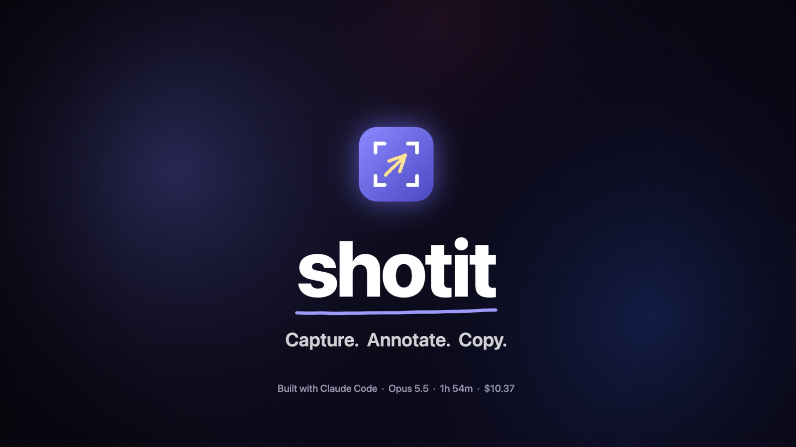
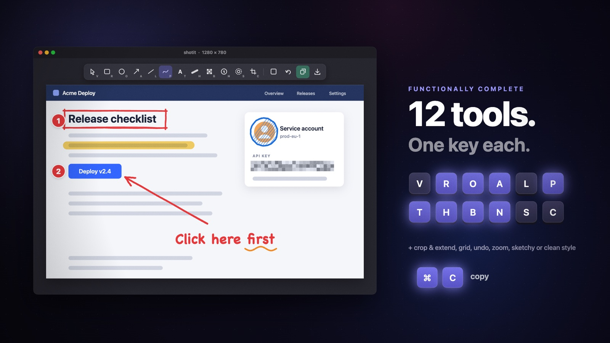
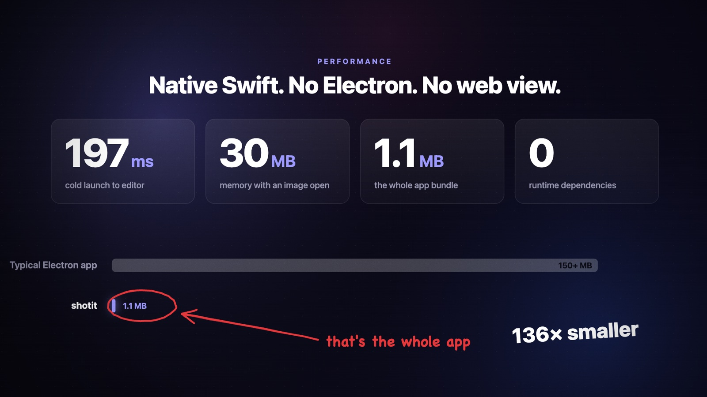
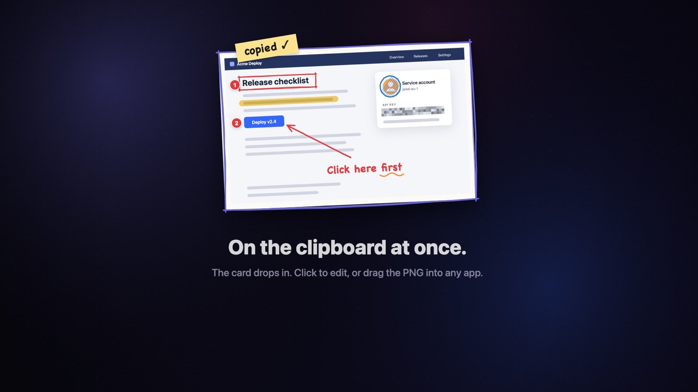

# shotit

A fast, small macOS screenshot editor. Capture or paste, annotate in Excalidraw style, copy back.

[](docs/shotit-reel.mp4)

Click the image to watch the 22-second showcase reel (720p MP4).





The images in this README are frames from the showcase reel.

## Install

Double-click `install.command` in Finder. It pulls the latest `main`, builds the app, quits the running
shotit, puts the new build in `/Applications`, and opens it.

## Build and run

Needs macOS 14+ and Command Line Tools (full Xcode is not necessary).

```sh
python3 scripts/bundle.py          # makes build/shotit.app
open build/shotit.app              # menu bar app, no Dock icon
swift run shotit-tests             # tests
```

You can also open an image or the clipboard from the command line:

```sh
build/shotit.app/Contents/MacOS/shotit --clipboard
build/shotit.app/Contents/MacOS/shotit path/to/image.png
```

## Keys

| Key | Action |
| --- | --- |
| ⇧⌘2 (global) | Capture a region or window. The capture goes to the clipboard and a card drops in at the top center. |
| ⇧⌘1 (global) | Edit the image on the clipboard |
| V 1, R 2, O 3, A 4, L 5, P 6, T 7 | Select, rectangle, ellipse, arrow, line, pen, text |
| H, B, N, S, C | Highlighter, blur, number step, spotlight, crop and extend |
| E | Add padding |
| G, ⌘' | Show or hide the grid. The toolbar grid button sets spacing and "Add grid to image". |
| Shift while dragging | Square, circle, 15° angles, straight highlighter |
| Space + drag, pinch, ⌘= ⌘- ⌘0 ⌘1 | Pan, zoom, fit, 100% |
| ⌘C / Return | Copy / copy and close |
| ⌘S, ⌘Z, ⇧⌘Z, ⌘D, Delete, arrows | Save, undo, redo, duplicate, delete, nudge |

## Quick-access card



After a capture, a tilted card drops in at the top center of the screen (the macOS thumbnail is at the
bottom right). Click it to annotate. Drag it to drop the PNG file into another app. Point at it for
Annotate, Copy, Save, and Close buttons. It closes after 10 seconds, but not while the pointer is on it.
To go straight to the editor, turn on "Open Editor After Capture" in the menu bar menu.

## Clipboard and Slack

Copy puts a PNG on the clipboard. An opaque image has no alpha channel, so the PNG is about 10% smaller with
no loss. For Slack, turn on "Copy at 1x Size" in the menu bar menu: a Retina capture is copied at half the
width and height, which is about half the bytes. Text is less sharp on a Retina screen. Save and drag always
keep full resolution.

## Editor windows

While an editor is open, shotit shows in the Dock and in the ⌘Tab switcher. The Window menu and the Dock
icon menu list the open editors. "Show Editor Windows" in the menu bar menu brings all editors to the front,
also minimized ones.

Capture needs the Screen Recording permission. macOS asks for it on the first capture.
An ad-hoc signed build can lose the permission after a rebuild. Grant it again in System Settings.
